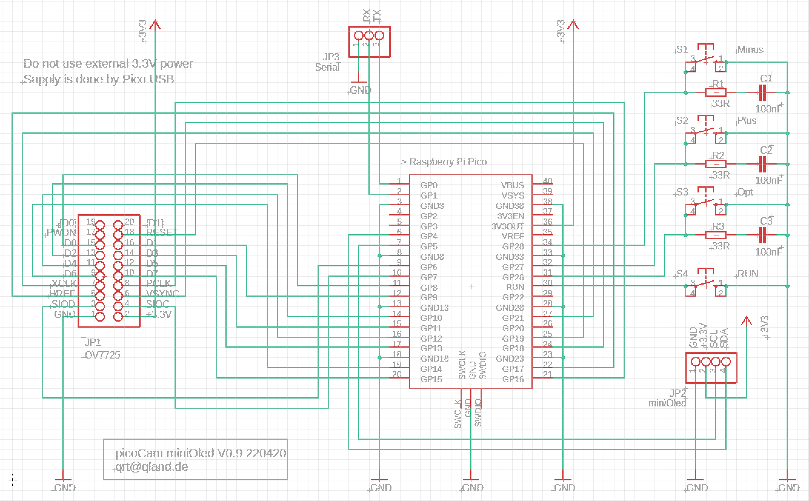

# **PicoCam**

### A nonsensical Scherzo for Camera and OLED-Display

<br>


Object -> Camera OV7725 -> Raspberry Pico RB2040 -> OLED-Display SSD1306 -> Viewer

<br>

## Summary
```
Question: Does connecting a VGA camera to a 0.96" monochrome display make sense? 
Answer:   Not really! (But, some fundamental RP2040 routines are exhibited)
```

## Links
[-> views](#views)  
[-> youTube](https://youtu.be/NsE_c5HfDDw)  
[-> source](source)

Slightly extended project with RGB OLED  
https://github.com/qrti/picoCamRgb

<br>

## Options (Overlay Display)
```
- brightness, contrast
- halftone patterns D2x2 - D3x3 - 1x1 noise - C2x2 - C3x3
  D = default polynomial distribution, C = custom linear distribution
- halftone black and white offset
  only visible for custom halftone patterns C2x2 and C3x3
- night vision
- vertical-flip, horizontal-flip
```

## Keys
```
- option show  / next
- value  minus / item previous
- value  plus  / item next
```

## Remarks
```
- camera OV7725 no fifo version (without RAM on PCB) is used for this project
- if the picture is distorted the camera might not have powered up properly
  try Pico reset (RUN (pin 30) to GND) or power up again
- OLED display might stuck in I2C handshake on Pico reset, try power up again
- OLED I2C frequency is tuned from default 400 KHz to 2 MHz to make the display more fluent
  if the display tends to stuck try to reduce I2CFREQ in oled.h
- halftone patterns 3x3 are wrapped from last to first row
- black/white halftone offsets for custom 2x2 and 3x3 are the same
- extreme black/white halftone offset values might produce strange display effects
- night vision might not switch off properly, reason unknown
- attached python scripts invoke the RP2040 assembler on .pio file changes when compiling
  see platform.ini, pre_script.py and post_script.py
- quart is for simple debugging with printf on serial TX (pin 1) and RX (pin 2)
```

## Schematic


<br>

## Software Structure
```
           ____ main ____
         /         \      \ 
      cam         oled      keys
     /   \          |        |
camCtrl  camData   text    option

core 0
cam data    -> PIO -> every 4th line -> DMA -> line buffer -> convert -> grey buffer
8 bit width           256 to 64                512x2 byte     RGB565     128x64 byte
512x256 pix                                    one line                  64 lines

-> VSYNC IR -> reset line counter
-> HREF IR  -> advance line counter, start DMA
-> 10 ms key polling routine for options

core 1
grey buffer -> halftone filter        -> video buffer -> I2C   -> OLED display
128x64 byte    2x2 - 3x3 - 1x1 noise |   128x64 bit      2 MHz    128x64 pix monochrome
                                     |
                    option overlay ->
```
<br>

### Developed and compiled with vsCode, platformIO and wizio-pico
https://code.visualstudio.com/  
https://platformio.org/  
https://github.com/Wiz-IO/wizio-pico  

<br>

---

<br>

## Views

Scene Total  

<br>
<br>

Detail  

<br>
<br>

Option off  

<br>
<br>

Option Brightness  

<br>
<br>

Option Contrast  

<br>
<br>

<br>
<br>

---

[qrt@qland.de](mailto:qrt@qland.de) 220222
